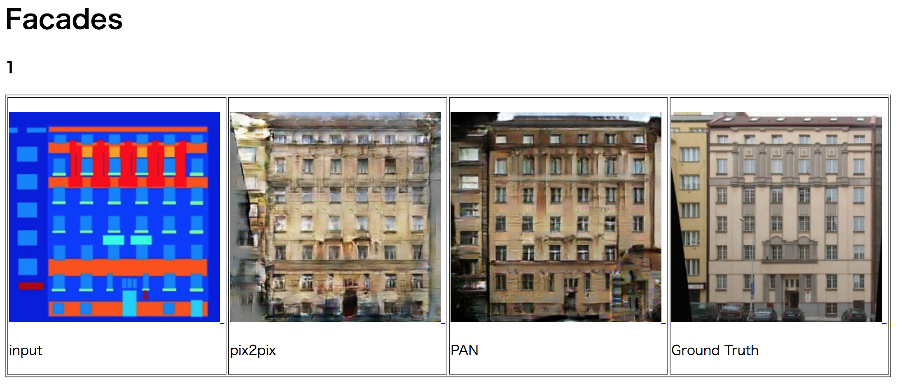

# pix2pix and PAN(Parceptual Adversarial Networks) in PyTorch
- Powered by [DL HACKS](http://deeplearning.jp/hacks/)
- Reference: https://github.com/junyanz/pytorch-CycleGAN-and-pix2pix
- pix2pix
  - Image-to-Image Translation with Conditional Adversarial Networks (CVPR2017)
  - Phillip Isola, Jun-Yan Zhu, Tinghui Zhou, Alexei A. Efros
  - https://arxiv.org/pdf/1611.07004v1.pdf
- PAN
  - Perceptual Adversarial Networks for Image-to-Image Transformation (2017)
  - Chaoyue Wang, Chang Xu, Chaohui Wang, Dacheng Tao
  - https://arxiv.org/pdf/1706.09138.pdf

## Requirements
- python 3.5
- pytorch 0.2.0

## Get Started
- Prepare  
```
pip install visdom dominate
```
- Get datasets (**時間がかかるので注意!! 試すだけならやらなくてOKです**)
  - デモでは ./datasets/tmp_facades の超小規模データ使います．(10枚train, 10枚test)
```
#bash ./datasets/download_pix2pix_dataset.sh facades
#bash ./datasets/download_pix2pix_dataset.sh cityscapes
#bash ./datasets/download_pix2pix_dataset.sh maps
```
- Demo Train/Test (GPU)
```
bash ./scripts/demo_pix2pix.sh [GPU_ID]
bash ./scripts/demo_pan.sh [GPU_ID]
```
- Demo Train/Test (CPU)
```
bash ./scripts/demo_pix2pix_cpu.sh
bash ./scripts/demo_pan_cpu.sh
```
- Real Dataset
  - Train:TITAN Xで半日程度
  - Test:数分．
```
#bash ./scripts/map_pix2pix.sh [GPU_ID]
#bash ./scripts/map_pan.sh [GPU_ID]
#bash ./scripts/city_pix2pix.sh [GPU_ID]
#bash ./scripts/city_pan.sh [GPU_ID]
#bash ./scripts/facades_pix2pix.sh [GPU_ID]
#bash ./scripts/facades_pan.sh [GPU_ID]
```
- ./scripts/ の中身をみてもらえば分かりますが，データセットごとに変わるのは(ほとんど)以下だけです．
  - ```--dataroot```: データセットの場所  
  - ```--which_direction```: 左→右 or 右→左  
  - ```--pan_mergin_m```: PANのpositive margin m  
  - ```--niter```: 学習率一定のエポック数．niter_decayと合わせて総エポック数 (この実験では全て200)
  - ```--niter_decay```: 学習率を減衰させるエポック数．niterと合わせて総エポック数 (この実験では全て200)
  - ```--batchSize```: バッチサイズ (この実験では全て4)  

## Results
- ./checkpoints に最新の重み, 途中の重みが保存されます．
- ./results に生成結果が保存されます．
- 出力結果 [Google Drive Link ](https://drive.google.com/drive/folders/0B4YWLm9F9kgpeVRhUEQyYzBCZkk?usp=sharing) ダウンロードしてhtmlを開くとinput, 生成画像, ground truthが並んで表示されます．
- PSNR(dB)での評価は以下．
```
python evaluation.py --imgs_path [path/to/result_images]
```

**PSNR**(なぜかpix2pixの方が良い結果になりました…)

|            | facades | maps        |cityscapes   |
|:-----------|:--------|:------------|:------------|
| pix2pix    |  28.00  | **31.62**   | **32.11** |
| PAN        |  **28.04**  | 30.52       | 31.52     |
